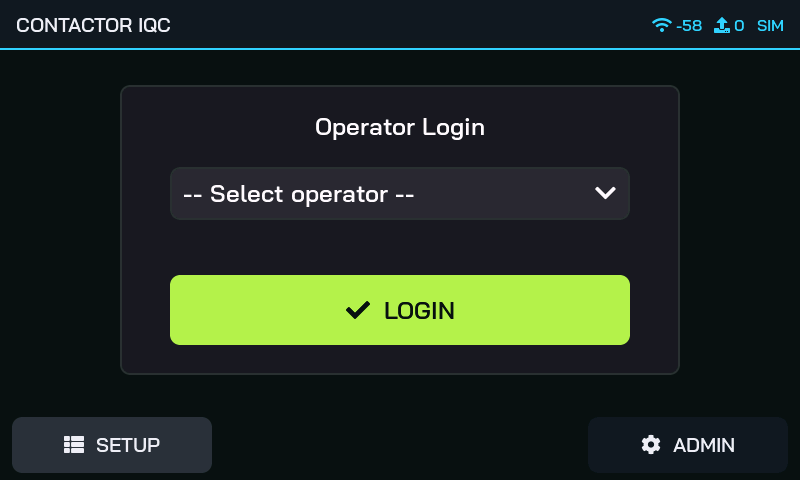
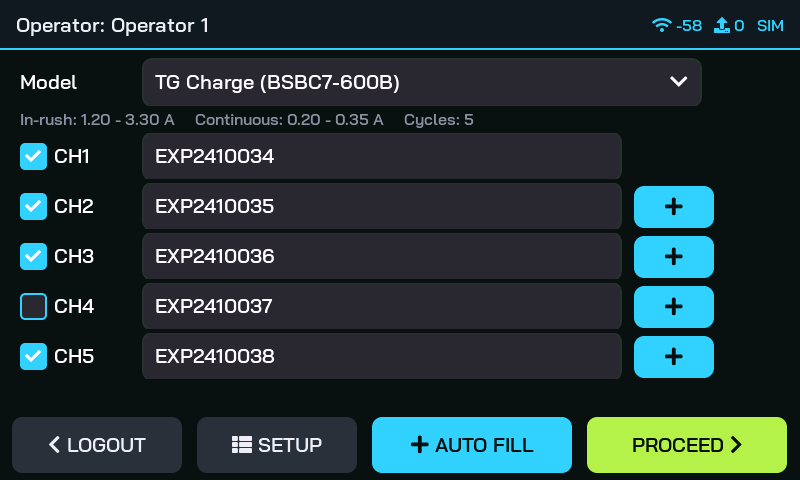
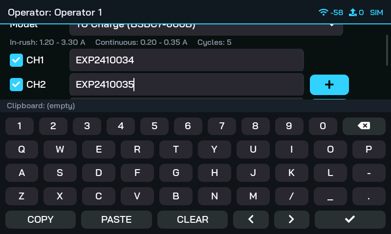
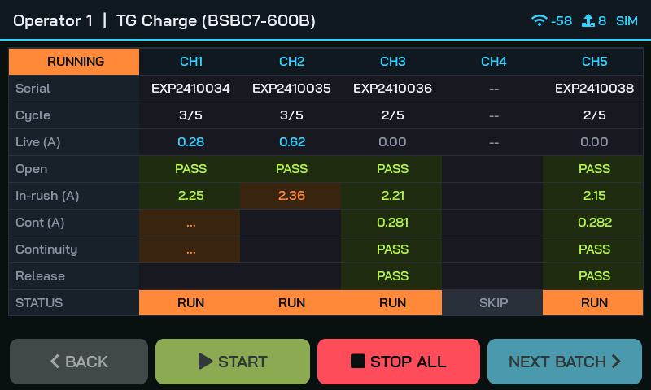
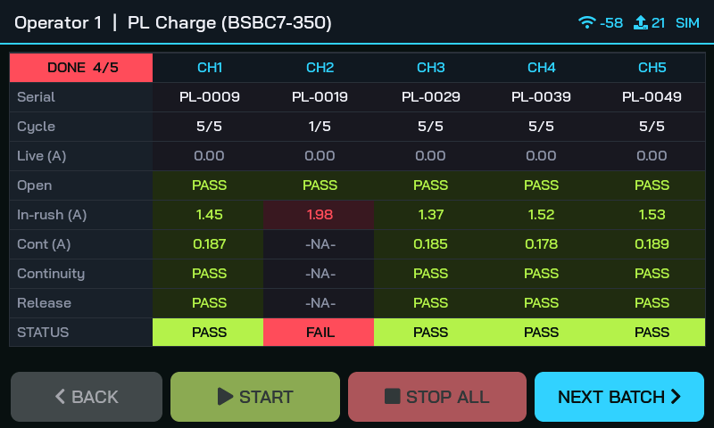
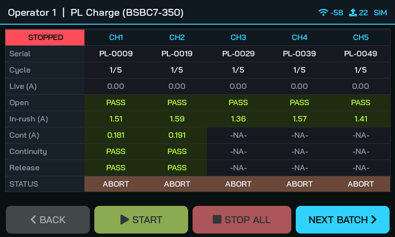
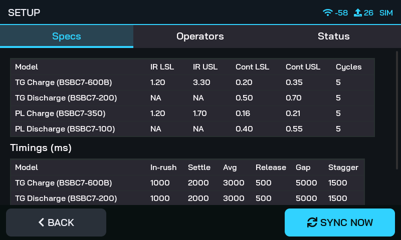
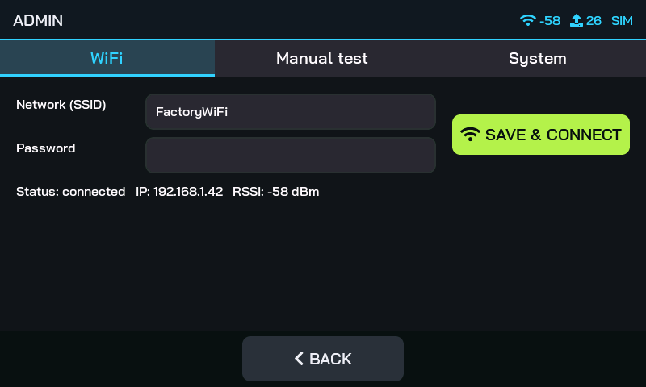

# Contactor IQC – HMI firmware (CrowPanel 7")

Touch-screen firmware for the **Elecrow CrowPanel 7" ESP32-S3 (DIS08070H, V3.0)**.

This first build has the **complete UI with a simulated test rig**. You can log in, pick a
model, enter 5 serials and run a full 5-channel batch on the screen before any relay,
INA219 or sub-board is wired. The header shows `SIM` while the simulation is active.

| Step | Status |
|---|---|
| UI: all screens, keyboard, 5-channel test table | ✅ this build |
| Test sequence (staggered start, stop at first fail, -NA- logging) | ✅ runs against simulated hardware |
| WiFi (credentials entered on the Admin screen) | ✅ this build |
| Google Sheets (specs, operators, results upload) | ⏳ next step |
| I²C link to the ESP32-S3 sub-board | ⏳ after the parts arrive |

## Screens

| | |
|---|---|
|  |  |
|  |  |
|  |  |
|  |  |

## Flashing (first time)

1. In VS Code: **File → Open Folder…** and select `hmi` (the folder that contains
   `platformio.ini`, not the repository root).
2. Wait for PlatformIO to finish "Installing…" in the bottom bar. The first time it downloads
   the ESP32 toolchain, LVGL and LovyanGFX, which takes 5–10 minutes.
3. Connect the CrowPanel to the PC with the USB-C port marked **UART0**.
4. Click **✓ Build** (bottom bar), then **→ Upload**.
   - If the upload can't find the board, uncomment `upload_port = COM11` in `platformio.ini`.
   - If it still fails, hold **BOOT**, tap **RESET**, release **BOOT**, then upload again.
     Press **RESET** after the upload finishes.
5. Click the **plug icon (Serial Monitor)** to see the log at 115200 baud. You should see
   `Contactor IQC HMI 0.1.0-ui-sim`.

## Trying it out

1. **Login:** pick *Operator 1* → LOGIN.
2. **Model:** pick a model and type a serial for CH1 with the on-screen keyboard.
   - **+** next to CH2…CH5 copies the serial above and adds 1 (`EXP2410034` → `EXP2410035`).
   - **AUTO FILL** fills every empty channel that way.
   - **COPY / PASTE / CLEAR** are on the keyboard.
   - Untick a channel to skip it.
3. **PROCEED → START.** Channels start 1.5 s apart, each runs 5 cycles, and about 2% of
   simulated cycles get a random fault, so you will see the occasional FAIL.
4. **STOP ALL** switches everything off and marks the unfinished steps `-NA-`.
5. **NEXT BATCH** keeps operator and model and clears the serials.
6. **ADMIN** (password `100100`): enter WiFi credentials, toggle relays manually, view system info.

The upload icon in the header counts result rows waiting to be sent to Google Sheets.
Nothing is uploaded yet; that comes with the Sheets step.

## If something looks wrong

| Symptom | What to tell me / try |
|---|---|
| Screen stays black | Send the Serial Monitor log. The backlight pin may differ on your board revision. |
| Display works but touch doesn't | Send the log line that starts with `[display]`. |
| Touch is offset or mirrored | Tell me which corner you tap and where the press lands. |
| Picture shifts or flickers when WiFi connects | Known ESP32-S3 RGB-panel issue; I'll lower the pixel clock in `display.cpp`. |

## Code layout

```
hmi
├── platformio.ini        board, PSRAM, libraries (LVGL 8.3.11, LovyanGFX 1.1.16)
├── include/lv_conf.h     LVGL settings
└── src
    ├── main.cpp          setup()/loop()
    ├── config.h          constants: channels, password, current range, I2C pins
    ├── display.cpp       RGB panel + GT911 touch + LVGL driver
    ├── app_data.cpp      models/limits and operator list (built-in defaults for now)
    ├── rig.cpp           5-channel test sequencer (moves to the sub-board later)
    ├── hw_sim.cpp        simulated relays / INA219 / contacts
    ├── net.cpp           WiFi
    ├── serial_util.cpp   "+" serial increment
    ├── fonts/            Bai Jamjuree SemiBold 16/20/24/32 px (+ LVGL symbols), OFL licence
    └── ui/
        ├── ui_theme.h    all colours, fonts and sizes
        ├── ui_common.cpp header, footer, buttons, pop-ups
        ├── ui_login.cpp  operator login
        ├── ui_model.cpp  model + 5 serials + keyboard
        ├── ui_test.cpp   5-channel result table
        ├── ui_setup.cpp  specs / operators / status (view only)
        └── ui_admin.cpp  password, WiFi, manual relay test, system
```

To change colours or text sizes, edit `src/ui/ui_theme.h`. Palette: near-black `#0F1115`,
cyan `#35D0FF`, orange `#FF8A3D` (running), lime `#B6F24A` (pass), plus red `#FF4D5E` for FAIL only.

Fonts were generated with `lv_font_conv` (4 bpp, ASCII + LVGL symbols). To add a size, run e.g.:
`npx lv_font_conv --bpp 4 --size 28 --no-compress --font BaiJamjuree-SemiBold.ttf --range 0x20-0x7E --font FontAwesome5-Solid+Brands+Regular.woff --range <symbol list from font_bai_16.c header> --format lvgl --lv-include lvgl.h -o font_bai_28.c`
